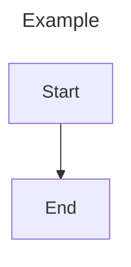

# Common Mermaid Syntax and Config

Official docs:
- https://mermaid.js.org/intro/syntax-reference.html
- https://mermaid.js.org/config/schema-docs/config.html

## Standard wrapper

Use `title` and `config` frontmatter only when needed.

## Universal rules

- Use one diagram declaration per block.
- Keep indentation consistent (2 spaces recommended).
- Use `%%` for comments.
- Quote labels containing punctuation or reserved tokens.
- Prefer stable ASCII IDs (`node_a`, `svc_api`) and human-readable labels.

## Parse checklist

1. Confirm declaration keyword is correct (`flowchart`, `sequenceDiagram`, etc).
2. Confirm block delimiters are closed (`end`, braces, section blocks).
3. Confirm relationship operators are valid for that diagram type.
4. Confirm config keys belong to Mermaid or that diagram's config namespace.
5. Remove mixed syntax copied from another diagram grammar.

## Common error patterns

- Using flowchart arrows inside non-flowchart diagrams.
- Missing `end` for nested blocks (for example `subgraph`, `alt`, `par`).
- Unescaped quotes in labels.
- Version mismatch for beta/experimental diagrams (`architecture-beta`, `radar-beta`, `treemap-beta`).
- Unsupported diagram in host renderer (common in older markdown renderers).

## Styling primitives

- Flowchart-like diagrams often support `classDef`, `class`, `style`, and `linkStyle`.
- Theme overrides can be set in frontmatter `config.themeVariables`.
- Prefer minimal styling so the diagram remains portable.

## Delivery pattern

- Return one complete Mermaid block.
- If requirements are ambiguous, state assumptions in one sentence after the code.
- If syntax support may depend on Mermaid version, mention that explicitly.
