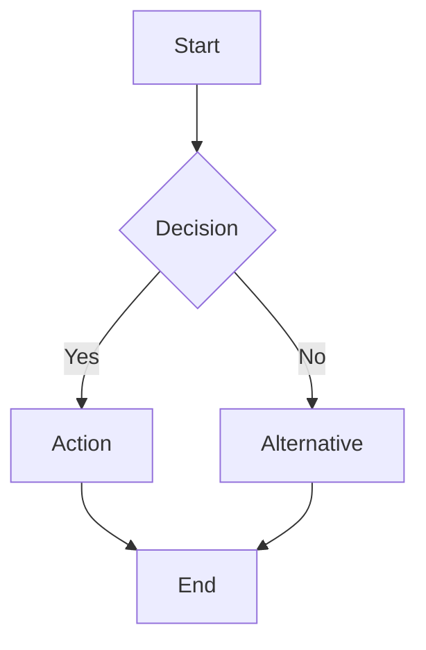

# Flowchart

Official syntax: https://mermaid.js.org/syntax/flowchart.html

## Starter template

## Core syntax

- Declare orientation: `TB`, `TD`, `BT`, `LR`, or `RL`.
- Define nodes with IDs and optional labels (`A[Label]`, `B{Decision}`).
- Use edges with arrows and optional labels (`A -->|text| B`).
- Group nodes with `subgraph ... end`.
- Use `classDef`, `class`, and `style` for targeted styling.

## Useful additions

- Add `click` handlers for interactive docs contexts.
- Add `direction` inside subgraphs when layout needs explicit control.
- Use markdown labels with quoted/backtick text when richer formatting is needed.

## Common mistakes

- Forgetting `end` after `subgraph`.
- Reusing a node ID with conflicting label intent.
- Overstyling early instead of confirming parse and layout first.
