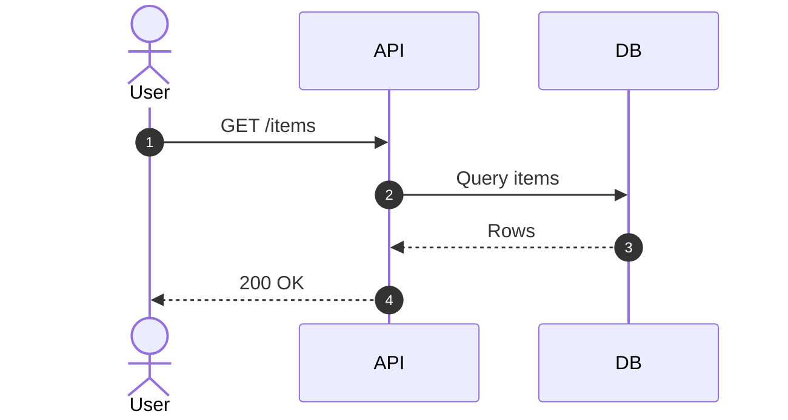

# Sequence Diagram

Official syntax: https://mermaid.js.org/syntax/sequenceDiagram.html

## Starter template

## Core syntax

- Define actors/participants: `actor`, `participant`.
- Use message arrows: `->`, `->>`, `-->>`, `-)`, and variants.
- Add `Note over`, `Note left of`, `Note right of` for context.
- Use control blocks: `alt/else/end`, `opt/end`, `loop/end`, `par/and/end`, `critical/option/end`.
- Use `activate` and `deactivate` for lifeline emphasis.

## Useful additions

- Use `autonumber` for long flows.
- Use `box ... end` to group participants logically.
- Model object lifecycle with `create` and `destroy` when needed.

## Common mistakes

- Forgetting `end` for control blocks.
- Mixing flowchart links (`-->`) into sequence grammar.
- Defining participants after first use in a complex chart.
