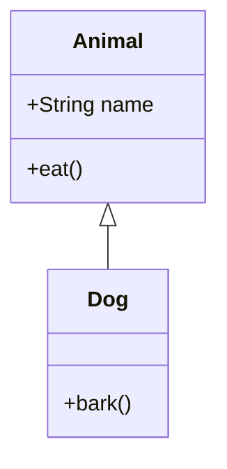

# Class Diagram

Official syntax: https://mermaid.js.org/syntax/classDiagram.html

## Starter template

## Core syntax

- Declare classes with `class Name` or full block bodies.
- Add members and methods inside class blocks.
- Use relationships:
  - Inheritance: `<|--`
  - Composition: `*--`
  - Aggregation: `o--`
  - Association: `-->`
  - Dependency: `..>`
  - Realization: `<|..`
- Add cardinality/labels on relationships when needed.
- Use `note for ClassName` for explanatory notes.

## Useful additions

- Organize large diagrams by namespace/package-style grouping.
- Use `classDef` and `cssClass` for semantic highlighting.

## Common mistakes

- Using ER-style symbols (`||--o{`) in class diagrams.
- Writing method signatures inconsistently across classes.
- Omitting visibility markers where they matter for the audience.
