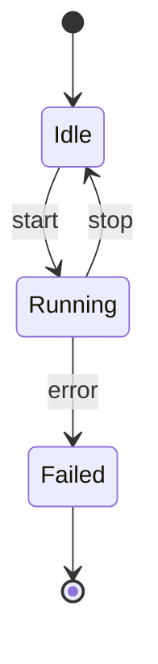

# State Diagram

Official syntax: https://mermaid.js.org/syntax/stateDiagram.html

## Starter template

## Core syntax

- Prefer `stateDiagram-v2` declaration.
- Use `[*]` for start/end pseudostates.
- Define transitions with labels (`A --> B: event`).
- Nest with composite states:
  - `state Parent { ... }`
- Use branch/concurrency constructs where needed (`<<choice>>`, forks/joins).

## Useful additions

- Add `note right of StateName` for transition explanation.
- Add direction control when layout clarity is poor.

## Common mistakes

- Forgetting closing braces for nested states.
- Using sequence or flowchart control keywords in state grammar.
- Modeling too many transitions without intermediate aggregation states.
