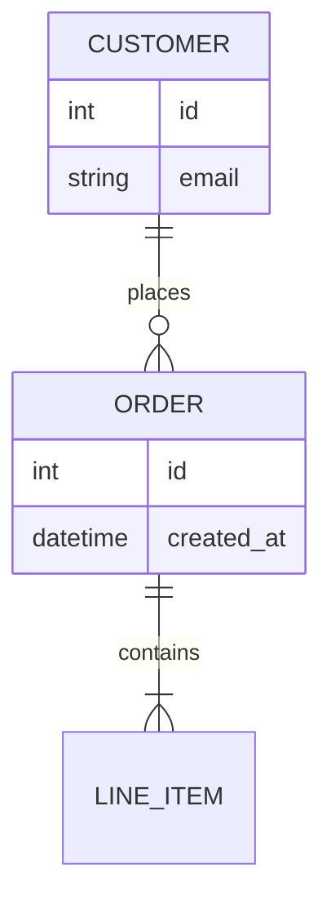

# Entity Relationship Diagram

Official syntax: https://mermaid.js.org/syntax/entityRelationshipDiagram.html

## Starter template

## Core syntax

- Declare entities with uppercase or stable IDs.
- Use relationship cardinality/operators (`||`, `|o`, `o{`, `|{`).
- Add relationship labels after colon (`: places`).
- Add attributes with type-first lines inside entity blocks.

## Useful additions

- Keep naming consistent with existing schema conventions.
- Use directional hints only when layout readability requires it.

## Common mistakes

- Mixing class-diagram operators with ER cardinality symbols.
- Using inconsistent attribute casing/typing conventions.
- Omitting relationship labels where semantics are non-obvious.
