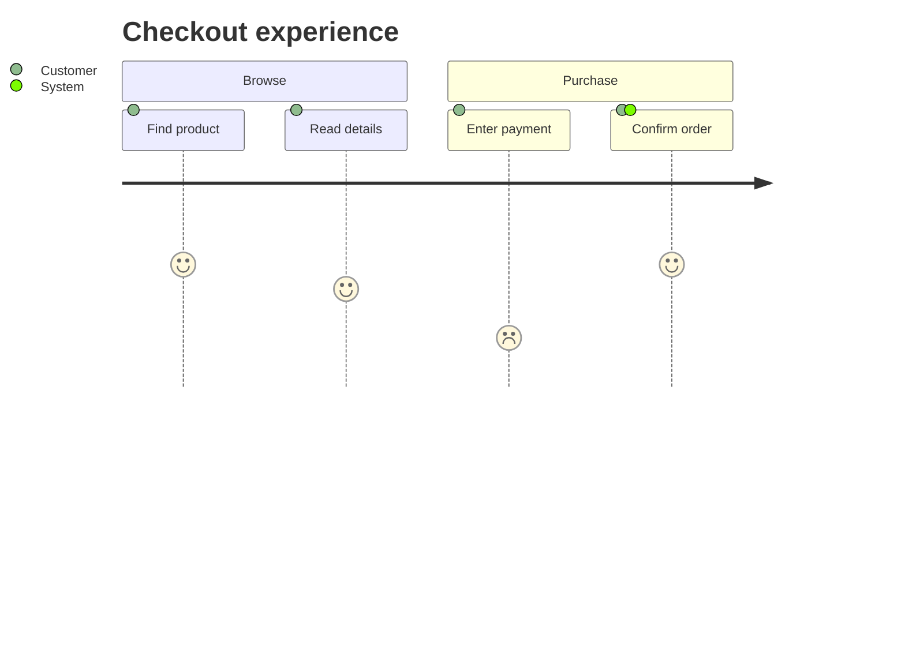

# User Journey

Official syntax: https://mermaid.js.org/syntax/userJourney.html

## Starter template

## Core syntax

- Start with `journey` and required `title`.
- Group steps with `section`.
- Define each step as `Task: score: actor, actor`.
- Use score (typically 1-5) to express user sentiment.

## Useful additions

- Keep sections outcome-based (not page-based) for clearer narratives.
- Use multiple actors only when ownership truly changes.

## Common mistakes

- Forgetting the score field.
- Using highly granular steps that dilute the story.
- Treating journey as strict sequence timing rather than experience map.
