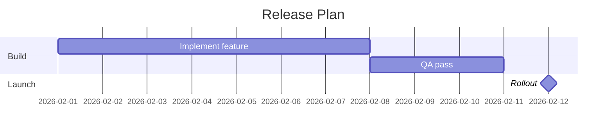

# Gantt

Official syntax: https://mermaid.js.org/syntax/gantt.html

## Starter template

## Core syntax

- Define `title` and `dateFormat` early.
- Group tasks with `section`.
- Define tasks with id/date/duration syntax.
- Use task flags: `milestone`, `done`, `active`, `crit` as needed.
- Use dependency syntax (`after taskId`) for sequencing.

## Useful additions

- Use `axisFormat` or tick settings for readability on long schedules.
- Exclude non-working days when schedule semantics require it.

## Common mistakes

- Mixing absolute dates and dependencies inconsistently.
- Forgetting durations for non-milestone tasks.
- Overusing critical styling so everything appears critical.
