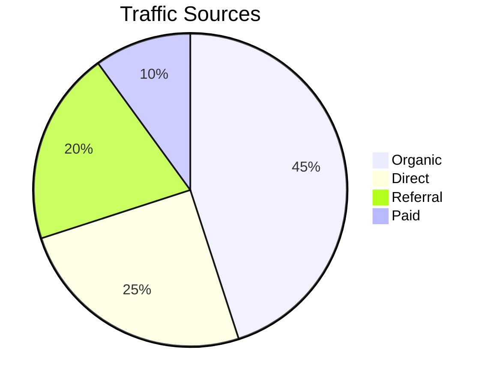

# Pie Chart

Official syntax: https://mermaid.js.org/syntax/pie.html

## Starter template

## Core syntax

- Start with `pie` and optional `title`.
- Add data as `"Label" : value`.
- Use numeric values (integers or decimals).

## Useful additions

- Adjust label placement using `config.pie.textPosition` when needed.
- Keep category count small for readability.

## Common mistakes

- Passing percentages with `%` characters instead of numbers.
- Including too many thin slices with long labels.
- Using pie for trend-over-time use cases (prefer `xychart`).
