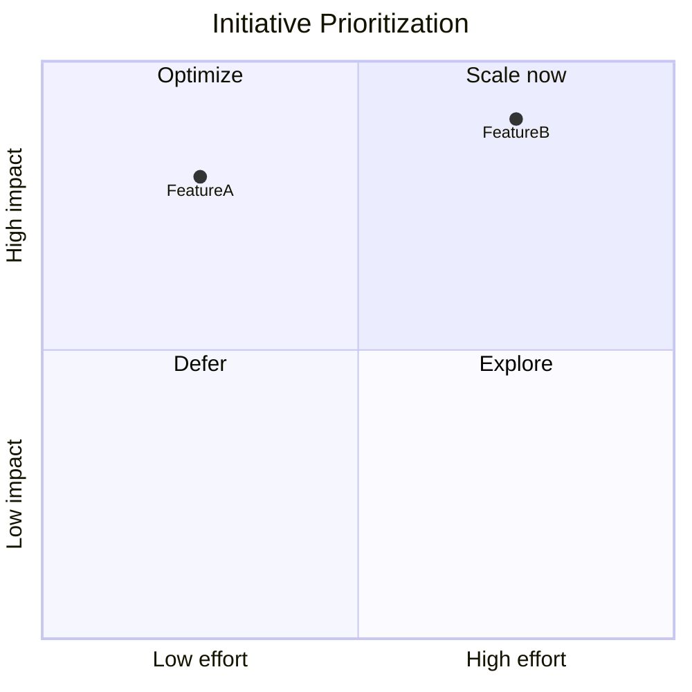

# Quadrant Chart

Official syntax: https://mermaid.js.org/syntax/quadrantChart.html

## Starter template

## Core syntax

- Set `x-axis` and `y-axis` descriptors.
- Label each quadrant with `quadrant-1` to `quadrant-4`.
- Add points as `Name: [x, y]` with normalized values.

## Useful additions

- Tune chart dimensions with config (`chartWidth`, `chartHeight`).
- Use sparse labels to avoid overlap.

## Common mistakes

- Forgetting quadrant labels for audience context.
- Using values outside expected axis range.
- Plotting too many points without grouping strategy.
