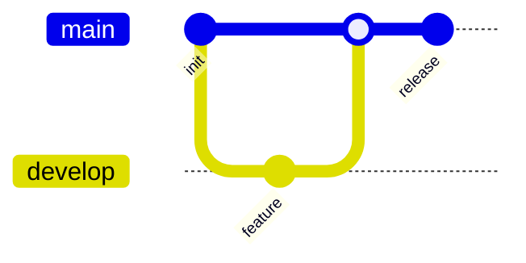

# GitGraph

Official syntax: https://mermaid.js.org/syntax/gitgraph.html

## Starter template

## Core syntax

- Start with `gitGraph`.
- Use operations: `commit`, `branch`, `checkout`, `merge`, `cherry-pick`.
- Use commit metadata options (`id`, `tag`, `type`) when clarity is needed.
- Configure branch/label display with frontmatter config keys.

## Useful additions

- Show only the key narrative commits.
- Use tags to mark releases and milestones.

## Common mistakes

- Switching to unknown branch names.
- Encoding full real history (too dense) instead of simplified narrative.
- Mixing command-like shell syntax inside diagram lines.
