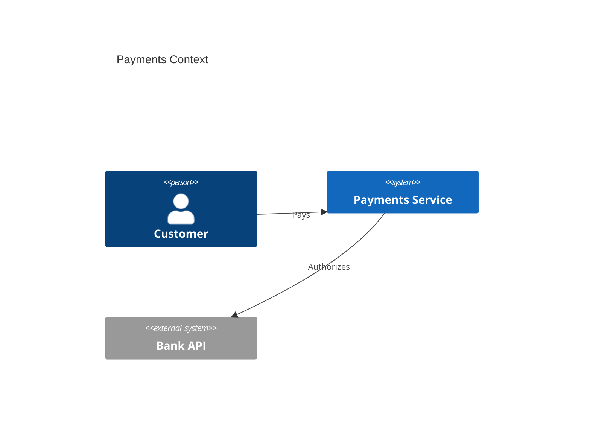

# C4 Diagram

Official syntax: https://mermaid.js.org/syntax/c4.html

## Starter template

## Core syntax

- Pick one C4 declaration per block:
  - `C4Context`
  - `C4Container`
  - `C4Component`
  - `C4Dynamic`
  - `C4Deployment`
- Use typed primitives (`Person`, `System`, `Container`, `Component`, `Deployment_Node`, etc).
- Connect nodes with `Rel` / `BiRel` and optional labels.
- Group with boundary helpers (`System_Boundary`, `Container_Boundary`, `Enterprise_Boundary`).

## Useful additions

- Keep aliases stable and short.
- Split levels into separate diagrams rather than one overloaded block.

## Common mistakes

- Mixing non-C4 mermaid grammar in C4 blocks.
- Reusing aliases across unrelated objects.
- Assuming all renderers support every latest C4 helper.
