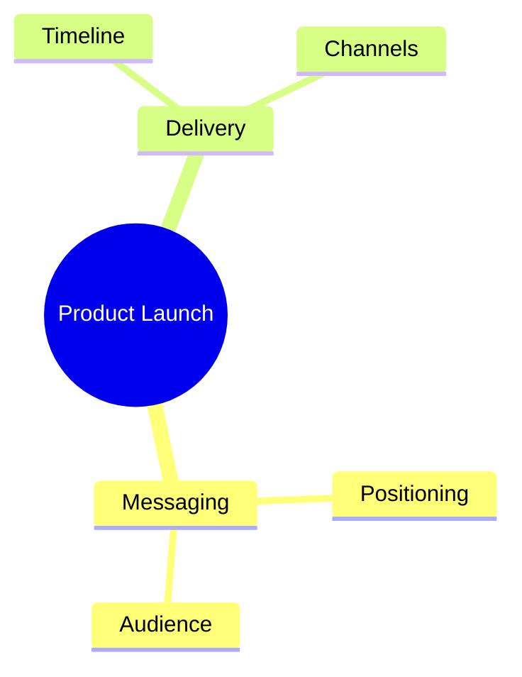

# Mindmap

Official syntax: https://mermaid.js.org/syntax/mindmap.html

## Starter template

## Core syntax

- Start with `mindmap` and define one `root` node.
- Build hierarchy by indentation.
- Use shape variants and icon/class helpers where supported.
- Keep node text short for readability.

## Useful additions

- Use semantic branches (goals, constraints, decisions).
- Keep depth balanced across sibling branches.

## Common mistakes

- Treating mindmap as process flow with arrows.
- Inconsistent indentation levels causing hierarchy errors.
- Overloading leaves with paragraph-length labels.
