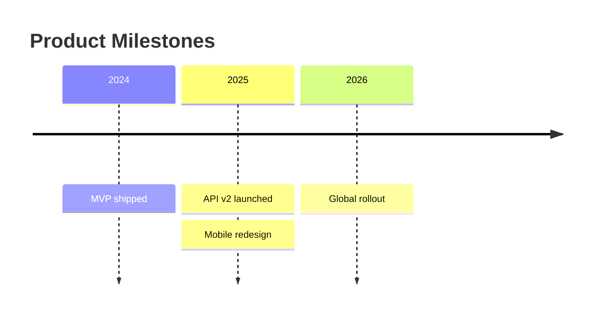

# Timeline

Official syntax: https://mermaid.js.org/syntax/timeline.html

## Starter template

## Core syntax

- Start with `timeline` and optional `title`.
- Use chronological labels as timeline anchors.
- Add one or more events per anchor line.
- Use `section` when grouping eras/themes improves readability.

## Useful additions

- Keep date granularity consistent (year-only or full dates).
- Use concise event phrases.

## Common mistakes

- Mixing timeline with duration/dependency semantics (use `gantt` for that).
- Using inconsistent date formats in a single chart.
- Overcrowding one time anchor with many long lines.
