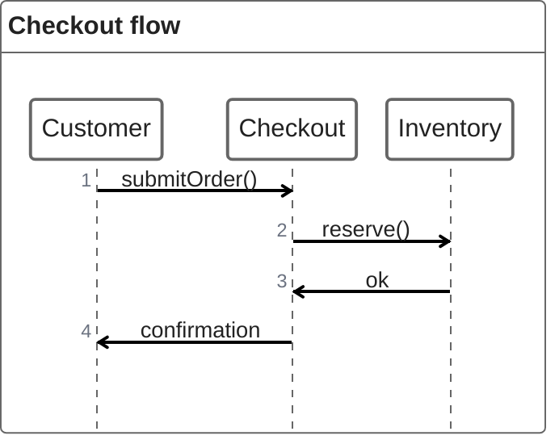

# ZenUML

Official syntax: https://mermaid.js.org/syntax/zenuml.html

## Starter template

## Core syntax

- Start with `zenuml`.
- Define participants and calls inline with arrow syntax.
- Model returns and control flow using ZenUML constructs (`if`, `while`, `par`, etc) as needed.
- Keep interactions code-like and method-oriented.

## Useful additions

- Use concise method names and parameter placeholders.
- Keep business conditions explicit in control blocks.

## Common mistakes

- Mixing `sequenceDiagram` keywords into ZenUML syntax.
- Assuming host renderer includes ZenUML support in older Mermaid setups.
- Writing full implementation code instead of interaction-level logic.
