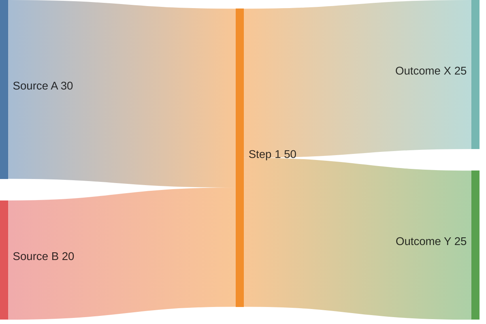

# Sankey

Official syntax: https://mermaid.js.org/syntax/sankey.html

## Starter template

## Core syntax

- Start with `sankey`.
- Provide comma-separated rows: `source,target,value`.
- Keep node naming exact and consistent across rows.
- Use numeric values only.

## Useful additions

- Set `config.sankey.showValues` when labels become noisy.
- Sort rows logically to improve readability in source control diffs.

## Common mistakes

- Adding headers in the Mermaid block.
- Using different spellings for the same node.
- Supplying non-numeric values.
