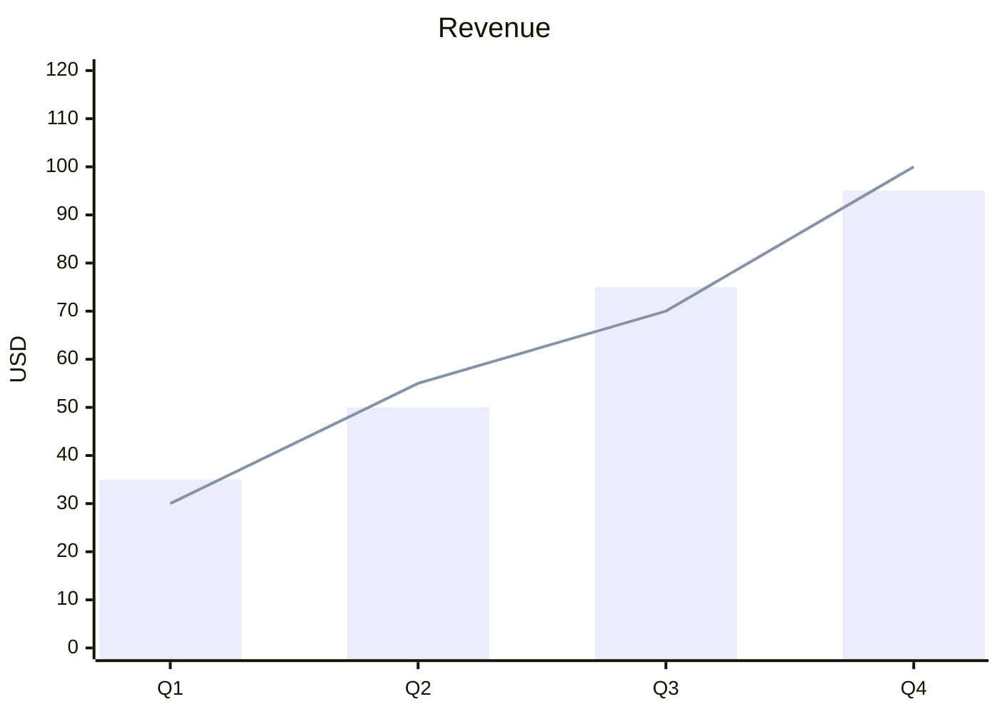

# XY Chart

Official syntax: https://mermaid.js.org/syntax/xyChart.html

## Starter template

## Core syntax

- Start with `xychart`.
- Define `x-axis` labels and `y-axis` label/range.
- Add one or more `bar` or `line` data series.
- Keep each series length aligned with x-axis points.

## Useful additions

- Use config palette overrides for multiple series clarity.
- Add data labels only when chart remains readable.

## Common mistakes

- Mismatched data lengths across series.
- Missing y-axis range causing unclear scaling.
- Using categorical labels in numeric y-axis series.
