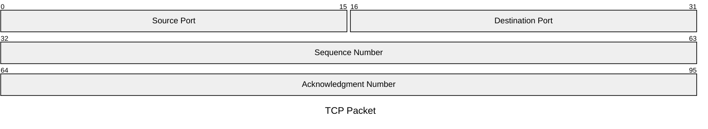

# Packet

Official syntax: https://mermaid.js.org/syntax/packet.html

## Starter template

## Core syntax

- Start with `packet`.
- Define bit ranges and labels per line.
- Keep ranges continuous and non-overlapping unless intentionally highlighting variants.
- Use quoted labels for protocol field names.

## Useful additions

- Add `title` in frontmatter for protocol version clarity.
- Group field sections logically by header segment.

## Common mistakes

- Overlapping ranges by accident.
- Skipping bit spans without explanation.
- Mixing packet grammar with generic flowchart nodes.
