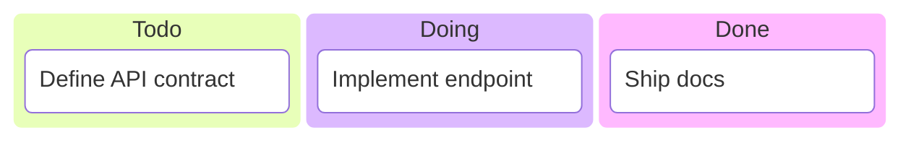

# Kanban

Official syntax: https://mermaid.js.org/syntax/kanban.html

## Starter template

## Core syntax

- Start with `kanban`.
- Define columns and tasks by indentation.
- Keep task IDs stable if you need cross-references.
- Use config options for ticket link templates when needed.

## Useful additions

- Keep columns aligned to your team's actual workflow.
- Use short task titles and move detail to external tracker links.

## Common mistakes

- Treating kanban as gantt with dates/dependencies.
- Creating too many workflow columns.
- Omitting stable IDs when task linking is needed.
