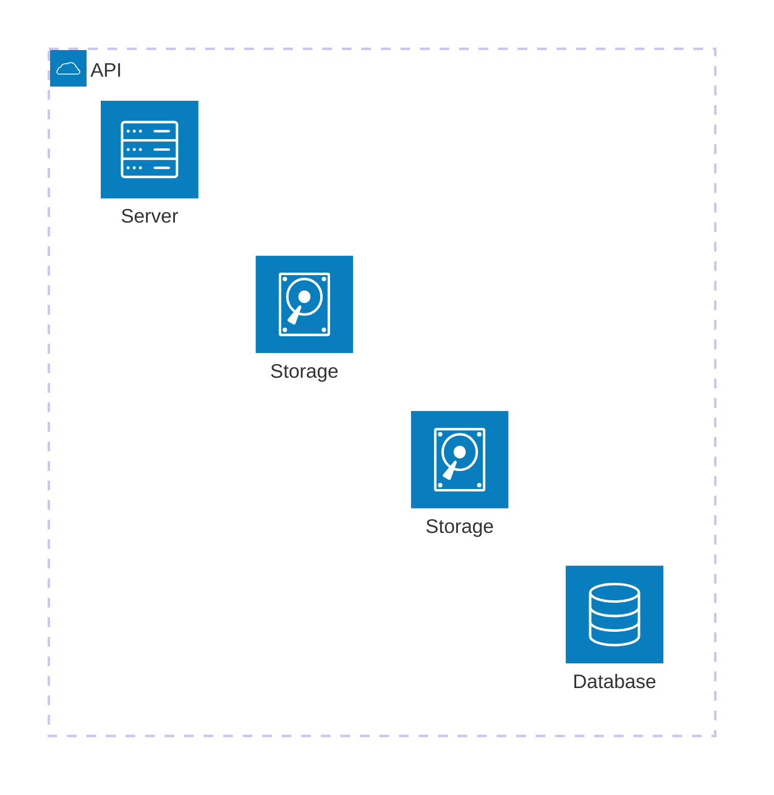

# Architecture

Official syntax: https://mermaid.js.org/syntax/architecture.html

## Starter template

## Core syntax

- Start with `architecture-beta`.
- Define `group` containers and `service` nodes with icon types.
- Place nodes into groups using `in groupId`.
- Connect services with side-specific connectors (`L`, `R`, `T`, `B`).

## Useful additions

- Keep aliases short and unique.
- Use groups to represent network or domain boundaries.

## Common mistakes

- Forgetting `-beta` in declaration.
- Using unsupported icon names in older Mermaid versions.
- Overusing directional connectors without a layout rationale.
