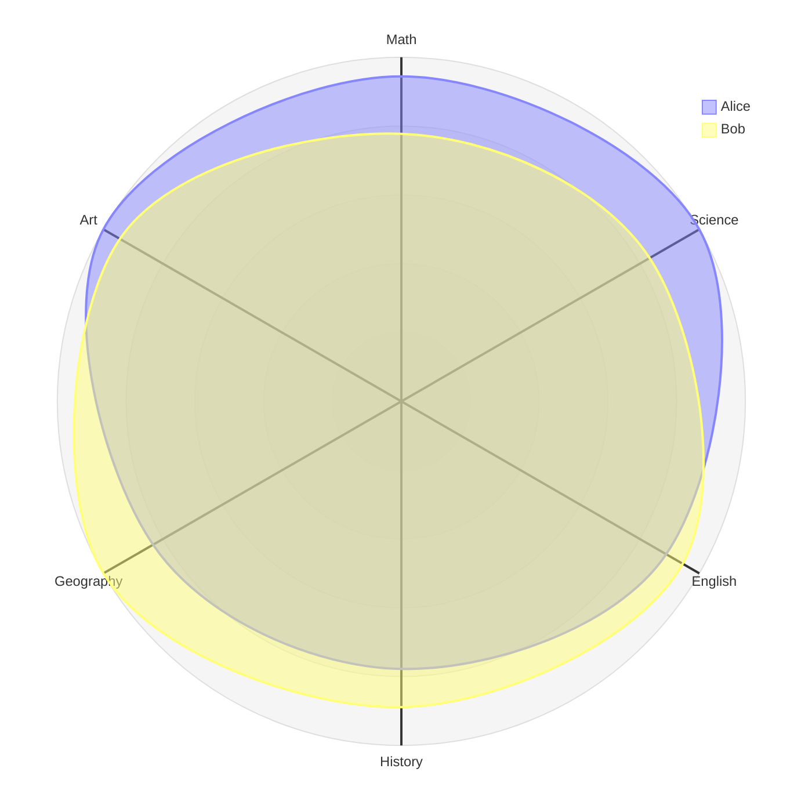

# Radar

Official syntax: https://mermaid.js.org/syntax/radar.html

## Starter template

## Core syntax

- Start with `radar-beta`.
- Define axes with IDs and labels.
- Add one or more `curve` datasets using ordered numeric values.
- Keep curve value count aligned with axis count.

## Useful additions

- Set min/max in config when default scaling is not meaningful.
- Use limited number of curves for readability.

## Common mistakes

- Forgetting `-beta` declaration.
- Mismatching number of axis points and curve values.
- Mixing incomparable metrics in one chart.
