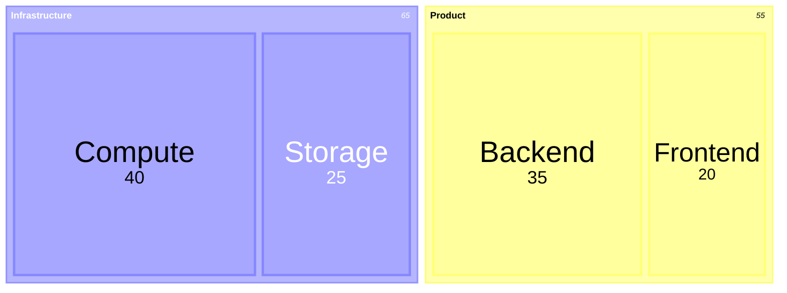

# Treemap

Official syntax: https://mermaid.js.org/syntax/treemap.html

## Starter template

## Core syntax

- Start with `treemap-beta`.
- Define parent categories and child value entries by indentation.
- Use numeric values for leaf nodes.
- Keep category naming consistent.

## Useful additions

- Use value formatting config when presenting money or percentages.
- Keep hierarchy depth shallow for readability.

## Common mistakes

- Forgetting `-beta` declaration.
- Adding non-numeric leaf values.
- Flattening all items without meaningful parent categories.
